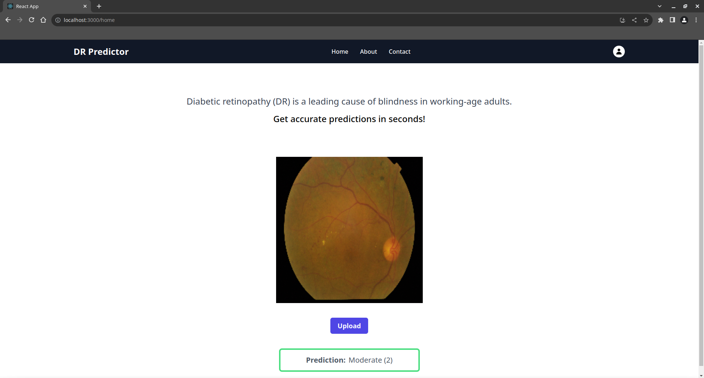

<h1 align="center"> Diabetic Retinopathy (DR) Classification </h1>

DR is a disorder that results in vision loss when high blood sugar levels damage the blood vessels in the retina. We built a Dynamic Convolutional Attention (DCA) based Resnet50 model to classify the severity of DR. The model was trained on the [Kaggle dataset](https://www.kaggle.com/c/aptos2019-blindness-detection/data) and achieved an accuracy of 0.79. The model was deployed using FastAPI and the frontend was built using React.

## Installation
To install all the required libraries run the following command.

`pip install requirements.txt`

To install tailwind & other packages, run the following command

`npm install`

Use your own API key and config in the firebase.js file.

## Demo

Run both frontend and backend in different terminals.

React frontend command:

`npm start`

fastapi backend command:

`uvicorn main:app --reload`

Home page

 </img>
